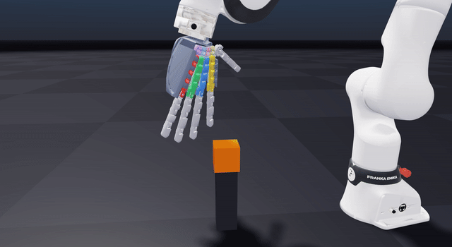

# DEXIGRAB

**/ˈdɛk.si.ɡræb/ (DEK-see-grab) - DEXIGRABs (plural): /ˈdɛk.si.ɡræbz/ (DEK-see-grabz)

An advanced, libre-source robot hand with integrated hybrid soft robotics, and soon GelSense-touch capabilities with pretrained sensor fusion RL models

## Introduction

"What? Another esoteric 3D printed robot hand project that's basically just a toy/puppet/useless gizmo dohicky with 5 string motors? No! There's too many of those already!"

Well, here's where I might change your mind regarding that!

## Features

- **Flexible TPU palm mechanics**, allowing for hybrid soft robotics that allow for actual grasping around curved objects in comparison to current traditional robotic palm mechanics
- 16 motors allowing for **16 DOF hand dexerity**, 3 DOF for each finger and 4 DOF on the thumb
- Straightforward 3D printing and assembly with **only 5-10 3D printed parts** to be assembled together for more plug-and-play use dynamics
- Mechanics and electronics **entirely constrained** inside the palm, allowing for full end-effector modularity with all current and future robotic manipulators
- To utilize a modified L3-F-TOUCH sensing module for the fingers and palm and a stereo raspberry pi camera system for sensor fusion data to train reliable deep reinforcement learning 
- **Universal Robot Attachment** system that can be 3D printed to interface with any robot arm's end effector attachment system
- **Multi-modal sensor fusion** integrating:
  - Intel® RealSense™ Depth Camera D455
  - L3-F-TOUCH sensing for tactile feedback
  - Arduino Pro Mini for motor encoder data collection

## AI & Simulation

The simulation work now lives in this repo — see [`Simulation/`](Simulation/):

- **Full physics model of the hand in NVIDIA Newton** (MuJoCo-Warp solver): the flexible
  TPU palm modeled as 8 spring palm bones with 3 closed kinematic loops, 22 finger DOFs,
  self-colliding shells, and **15-pad tactile sensing**
- **Arm-mounted grasp demo** (Franka FR3) with an honest `--check` gate — a pass requires a
  clean approach, multi-pad tactile contact, and a real lift, not a cube wedged in the shell
- **GPU-batched in-hand reorientation RL environment** + self-contained PPO trainer,
  validated at **N=8192 parallel worlds, 0.0% solver divergence, ~47k env-steps/s** on a
  single RTX 5090 — plus the full forensics of the batched-solver NaN failure mode that had
  to be root-caused to get there
- **Honest RL status**: reorientation policies stall for contact-fidelity reasons documented
  in [`Simulation/README.md`](Simulation/README.md), so no pretrained models are published
  yet — that finding is what redirected this project toward engine-level contact-physics
  work, rather than shipping policies from a sim that can't be trusted

## Related Resources

- [L3-F-TOUCH shown](https://youtu.be/ASt3WRFcAxU?si=XV7Dn4dw2RqogxgP)
- [General Concept of touch module](https://youtu.be/qtQ4rK66vlE?si=lcGbKkfz59pFsFFY)
- [Simulation environment to be possibly integrated](https://github.com/facebookresearch/tacto)

## Applications

- Primary use as a **robotic end effector** with advanced grasping capabilities
- Secondary application as a **low-weight and cost-accessible hand for prosthetics design**, especially if built with worm drive gearboxes for human-level gripping strength
- Customizable socket system (hopefully also full copyleft) for any given person

## Project Details

- **<$500 cost to build**
- **Fully open source hardware and software** under the GPL 3.0 and CERN-OHL pair license :)

## Coming Soon^TM

- Assembly instructions
- Component lists
- Software setup guide
- Simulation integration details
- Attachment system designs
